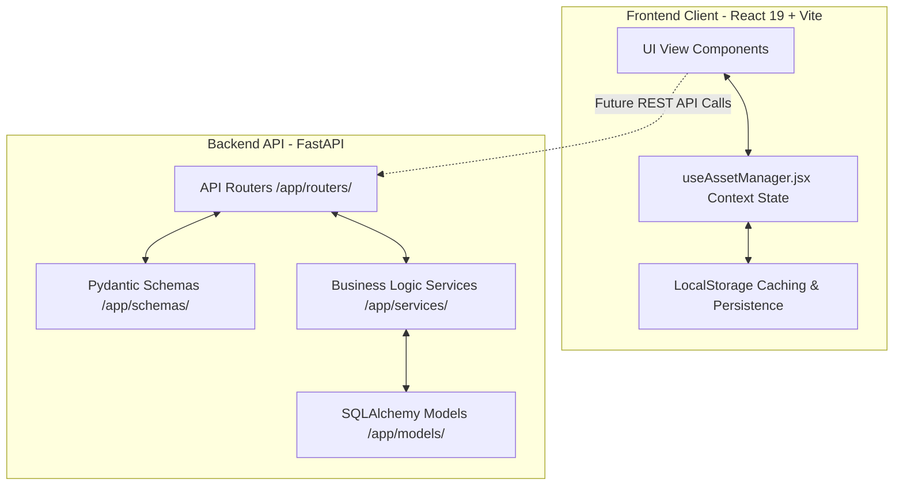
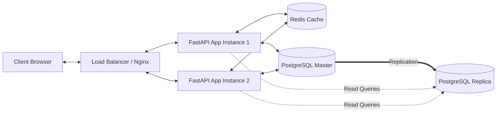
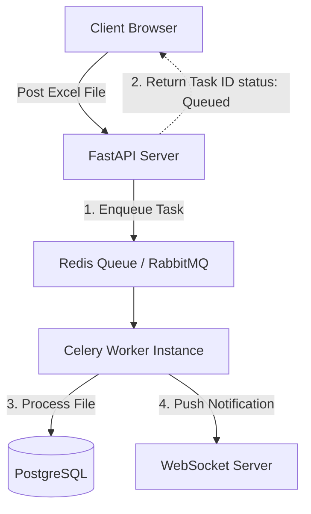

# System Architecture & Production System Design Report

This report outlines the software architecture used in the **IT Asset Management System** and provides a comprehensive system design roadmap for transitioning the current stack into a highly scalable, reliable, and production-ready enterprise application.

---

## 1. Current System Architecture

The application is structured as a **decoupled Client-Server architecture** consisting of a React-based Single Page Application (SPA) frontend and a modular FastAPI python backend stub.

### A. Frontend Architecture (Vite + React 19)
- **Vite Build Engine**: Provides fast Hot Module Replacement (HMR) and optimized Rollup-based production bundles.
- **State Management**: Implements the React Context API (`useAssetManager.jsx`) acting as the single source of truth. All assets, employees, repairs, categories, activity logs, and authentication states are maintained in a global React context.
- **Data Persistence**: Uses LocalStorage sync layers to save state changes, ensuring data survives browser reloads.
- **Styling & Icons**: Tailwind CSS utility framework with high-fidelity custom design patterns (combobox dropdowns, modal windows) and Lucide React icons.

### B. Modular Backend Architecture (FastAPI Stub)
The `backend` directory is organized using enterprise Python design patterns:
- `main.py`: Entrypoint establishing the FastAPI application instance.
- `routers/`: Endpoint definitions separated by business domains (assets, employees, maintenance).
- `models/`: Database entities mapped via ORM (SQLAlchemy).
- `schemas/`: Pydantic models for data validation, parsing, and serialization.
- `services/`: Encapsulated core business logic, decoupled from HTTP endpoints.

---

## 2. Production Scalability & Reliability Concepts

To scale the IT Asset Management application to support thousands of concurrent requests, enterprise asset rosters, and high availability, we recommend implementing the following system design upgrades.

---

## 3. Scalable Database & Caching Architecture

For production-level performance, data reads must be highly optimized, and write operations must guarantee integrity.

### A. Database Layer Upgrades (PostgreSQL)
- **Database Selection**: Use **PostgreSQL** for relational data integrity (ACID compliance) and JSONB support.
- **Connection Pooling**: Implement **PgBouncer** or SQLAlchemy's built-in `QueuePool` to manage database connections efficiently, preventing socket depletion under high load.
- **Read/Write Split**: Configure Master-Slave replication. Direct write operations (Add Asset, Assign Asset) to the Master instance, and scale read queries (List Assets, Reports) across read-only replica nodes.

### B. High-Performance Caching (Redis)
- **Session Caching**: Store active admin authentication sessions and JWT blacklist tokens in **Redis** for sub-millisecond retrieval.
- **Dashboard Metric Caching**: Cache expensive aggregated metrics (e.g., total asset counts, department-wise breakdowns) with a Time-To-Live (TTL) of 5–10 minutes to reduce database CPU cycles.
- **Query Caching**: Cache static categories list and employee lists, invalidating the cache only upon modifications (writes).

---

## 4. Asynchronous Processing & Background Workers

Heavy compute tasks, such as spreadsheet importing/exporting or sending notifications, should not block the main API request-response loop.

### A. Task Queue (Celery + RabbitMQ)
- **Excel Bulk Import/Export**: Delegate Excel file parsing and roster validation (e.g., importing 5,000 assets) to **Celery workers**. The client receives a `202 Accepted` response with a `task_id` and polls or awaits the task status.
- **Audit Trails**: Push activity logs asynchronously to a message broker (RabbitMQ or Kafka) to prevent auditing overhead from slowing down user transactions.

### B. Real-Time Communication (WebSockets)
- Use FastAPI WebSockets or **socket.io** to notify active administrators in real time when bulk operations complete or when an asset repair ticket requires immediate action.

---

## 5. Enterprise Reliability & High Availability

Reliability ensures that the system is resilient to individual node crashes, database failovers, and security threats.

### A. Stateless API Layer & Containers
- **Stateless Design**: Ensure FastAPI services maintain no local state. Deploy services in lightweight Docker containers.
- **Auto-Scaling (Kubernetes)**: Orchestrate containers using Kubernetes (EKS/GKE). Define Horizontal Pod Autoscaling (HPA) to scale up FastAPI replicas automatically based on CPU and memory thresholds.

### B. Resiliency & Disaster Recovery
- **Continuous Backups**: Set up automated write-ahead logging (WAL) backups (e.g., using AWS Aurora or WAL-G) to achieve point-in-time recovery (PITR) in the event of database corruption.
- **Multi-AZ Deployment**: Deploy application instances across multiple Availability Zones (AZs) behind an AWS Application Load Balancer (ALB) to survive data center failures.
- **Rate Limiting**: Implement rate limiting at the API Gateway level (e.g., Nginx, Kong, or Cloudflare) using token bucket algorithms to prevent Denial of Service (DoS) attacks and API abuse.

### C. Security Hardening
- **Authentication**: Migrate to OAuth2 using JWT (JSON Web Tokens) with short expiration periods (e.g., 15 minutes) and HTTP-only cookies to prevent XSS.
- **Data Encryption**: Force TLS 1.3 for data-in-transit and AES-256 block encryption for databases (data-at-rest).
- **RBAC**: Implement fine-grained Role-Based Access Control (RBAC) in the backend to ensure only authorized administrators can perform write and delete operations.
